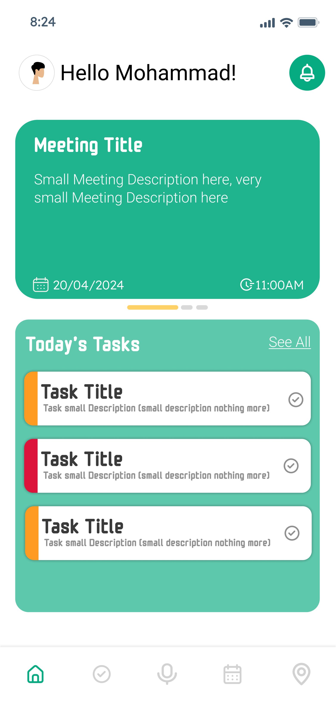
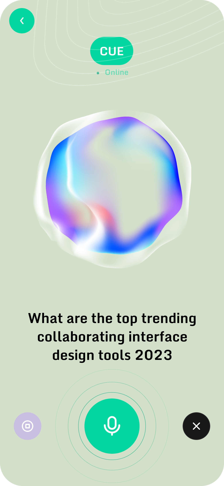
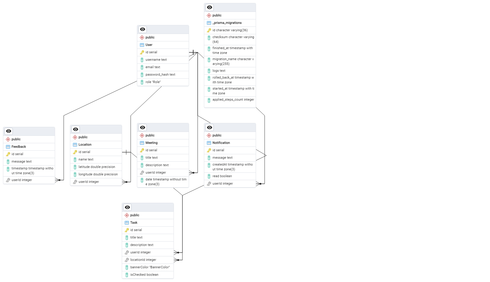

<br><br>

<!-- project philosophy -->


> An Intelligent personal assistant app which uses voice commands and location awareness to streamline your daily tasks and keep you on top of your schedule. AI smart contextual awareness notification system ensures that you won't need any other personal assistant after Cue, your new best assistant.

### User Stories
- As a user, I want to use voice commands to manage tasks and access information, so I can be more productive.
- As a user, I want location-based reminders to stay on schedule and avoid missing important tasks.
- As a user, I want to manage my calendar with voice commands through the app, so I can keep my schedule organized hands-free.

### Admin Stories
- As an admin, I want to view user activity statistics to understand usage patterns, so I can make informed decisions about app improvements.
- As an admin, I want to view user feedbacks, so I can make app improvements based on user needs.
- As an admin, I want to get AI suggestions for possible app improvements based on user feedbacks 

<br><br>
<!-- Tech stack -->


###  Cue is built using the following technologies:

- This project uses the [Flutter app development framework](https://flutter.dev/). Flutter is a cross-platform hybrid app development platform which allows us to use a single codebase for apps on mobile, desktop, and the web.
- For persistent storage (database), the app uses [PostgreSQL](https://www.postgresql.org/). PostgreSQL is a powerful, open-source object-relational database system that allows us to create and manage our app's data effectively.
- To send notifications, the app uses [Forebase Cloud Messaging (FCM)](https://firebase.google.com/docs/cloud-messaging) FCM supports Android, iOS, and the web, allowing us to send and receive messages reliably across platforms.
- The app uses the fonts ["MonomaniacOne"](https://fonts.google.com/specimen/Monomaniac+One) and ["Roboto"](https://fonts.google.com/specimen/Roboto) to enhance the visual appeal and readability of the app. 

<br><br>
<!-- UI UX -->


> We designed Cue using wireframes and mockups, iterating on the design until we reached the ideal layout for easy navigation and a seamless user experience.

- Project Figma design [figma](https://www.figma.com/design/IFyidG2fCVOtcW0woehz5H/Cue---Your-Personal-Assistant?node-id=0%3A1&t=859wGwG9APzQMKGf-1)


### Mockups
| Home screen  | Assistant Screen | onBoarding screen |
| ---| ---| ---|
|  |  |  |

<br><br>

<!-- Database Design -->


###  Architecting Data Excellence: Innovative Database Design Strategies:

- Insert ER Diagram here



<br><br>


<!-- Implementation -->


### User Screens (Mobile)
| Login screen  | Register screen | Landing screen | Loading screen |
| ---| ---| ---| ---|
|  |  |  |  |
| Home screen  | Menu Screen | Order Screen | Checkout Screen |
|  |  |  |  |

### Admin Screens (Web)
| Login screen  | Register screen |  Landing screen |
| ---| ---| ---|
|  |  |  |
| Home screen  | Menu Screen | Order Screen |
|  |  |  |

<br><br>


<!-- Prompt Engineering -->


###  Mastering AI Interaction: Unveiling the Power of Prompt Engineering:

- This project uses advanced prompt engineering techniques to optimize the interaction with natural language processing models. By skillfully crafting input instructions, we tailor the behavior of the models to achieve precise and efficient language understanding and generation for various tasks and preferences.

<br><br>

<!-- AWS Deployment -->


###  Efficient AI Deployment: Unleashing the Potential with AWS Integration:

- This project leverages AWS deployment strategies to seamlessly integrate and deploy natural language processing models. With a focus on scalability, reliability, and performance, we ensure that AI applications powered by these models deliver robust and responsive solutions for diverse use cases.

<br><br>

<!-- Unit Testing -->


###  Precision in Development: Harnessing the Power of Unit Testing:

- This project employs rigorous unit testing methodologies to ensure the reliability and accuracy of code components. By systematically evaluating individual units of the software, we guarantee a robust foundation, identifying and addressing potential issues early in the development process.

<br><br>


<!-- How to run -->


> To set up Coffee Express locally, follow these steps:

### Prerequisites

This is an example of how to list things you need to use the software and how to install them.
* npm
  ```sh
  npm install npm@latest -g
  ```

### Installation

_Below is an example of how you can instruct your audience on installing and setting up your app. This template doesn't rely on any external dependencies or services._

1. Get a free API Key at [example](https://example.com)
2. Clone the repo
   git clone [github](https://github.com/your_username_/Project-Name.git)
3. Install NPM packages
   ```sh
   npm install
   ```
4. Enter your API in `config.js`
   ```js
   const API_KEY = 'ENTER YOUR API';
   ```

Now, you should be able to run Coffee Express locally and explore its features.