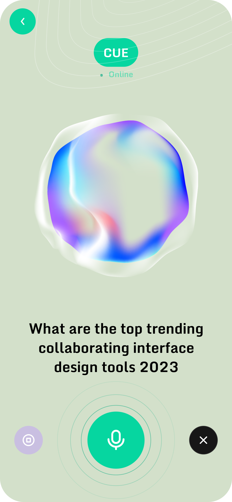

<br><br>

<!-- project philosophy -->


> An Intelligent personal assistant app which uses voice commands and location awareness to streamline your daily tasks and keep you on top of your schedule. AI smart contextual awareness notification system ensures that you won't need any other personal assistant after Cue, your new best assistant.

### User Stories
- As a user, I want to use voice commands to manage tasks and access information, so I can be more productive.
- As a user, I want location-based reminders to stay on schedule and avoid missing important tasks.
- As a user, I want to manage my calendar with voice commands through the app, so I can keep my schedule organized hands-free.

### Admin Stories
- As an admin, I want to view user activity statistics to understand usage patterns, so I can make informed decisions about app improvements.
- As an admin, I want to view user feedbacks, so I can make app improvements based on user needs.
- As an admin, I want to get AI suggestions for possible app improvements based on user feedbacks 

<br><br>
<!-- Tech stack -->


###  Cue is built using the following technologies:

- **[Flutter](https://flutter.dev/):** Flutter is a cross-platform hybrid app development framework allowing us to use a single codebase for apps on mobile, desktop, and the web.
- **[NestJS](https://nestjs.com/):** NestJS is a progressive Node.js framework for building efficient, reliable, and scalable server-side applications. We use NestJS with TypeScript for our backend development.
- **[Prisma](https://www.prisma.io/):** Prisma is an open-source ORM that simplifies database management and querying for our PostgreSQL database.
- **[PostgreSQL](https://www.postgresql.org/):** PostgreSQL is a powerful, open-source object-relational database system that allows us to create and manage our app's data effectively.
- **[Firebase Cloud Messaging (FCM)](https://firebase.google.com/docs/cloud-messaging):** FCM supports Android, iOS, and the web, allowing us to send and receive messages reliably across platforms.
- **Fonts:** The app uses ["MonomaniacOne"](https://fonts.google.com/specimen/Monomaniac+One) and ["Roboto"](https://fonts.google.com/specimen/Roboto) to enhance the visual appeal and readability of the app.

<br><br>
<!-- UI UX -->


> We designed Cue using wireframes and mockups, iterating on the design until we reached the ideal layout for easy navigation and a seamless user experience.

- Project Figma design [figma](https://www.figma.com/design/IFyidG2fCVOtcW0woehz5H/Cue---Your-Personal-Assistant?node-id=0%3A1&t=859wGwG9APzQMKGf-1)


### Mockups
| Home screen  | Assistant Screen | onBoarding screen |
| ---| ---| ---|
|  |  |  |

<br><br>

<!-- Database Design -->


###  Architecting Data Excellence: Innovative Database Design Strategies:


<br><br>


<!-- Implementation -->


### User Screens (Mobile)
| Onboarding screen  | Login screen | Signup screen |
| ---| ---| ---|
|  |  |  |
| Home screen  | Assistant Screen | Schedule Screen |
|  |  |  |

### Admin Screens (Desktob | Web)
| Login screen  |  Dashboard screen |
| ---| ---|
|  |  |
<br><br>


<!-- Prompt Engineering -->


###  Mastering AI Interaction: Unveiling the Power of Prompt Engineering:

- We use advanced prompt engineering techniques to optimize interaction with natural language processing models. This ensures precise and efficient language understanding and generation for various tasks and preferences.

<br><br>

<!-- AWS Deployment -->


###  Efficient AI Deployment: Unleashing the Potential with AWS Integration:

- This project leverages AWS deployment strategies to seamlessly integrate and deploy natural language processing models. With a focus on scalability, reliability, and performance, we ensure that AI applications powered by these models deliver robust and responsive solutions for diverse use cases.

<br><br>

<!-- Unit Testing -->


###  Precision in Development: Harnessing the Power of Unit Testing:

- This project employs rigorous unit testing methodologies using Jest to ensure the reliability and accuracy of code components. By systematically evaluating individual units of the software, we guarantee a robust foundation, identifying and addressing potential issues early in the development process.


<br><br>


<!-- How to run -->


> To set up Cue locally, follow these steps:

### Prerequisites

Ensure you have the following installed:
* Flutter:
Install Flutter by following the instructions on the Flutter installation page.
* npm
  ```sh
  npm install npm@latest -g
  ```
* nestJS
  ```sh
  npm i -g @nestjs/cli
  ```

### Installation


1. Clone the repo
   git clone [github](https://github.com/MhaamadAli/Cue-App.git)
2. Install NPM packages
   ```sh
   npm install
   ```
3. Enter your API in `.env`
   ```js
   const API_KEY = 'ENTER YOUR API';
   ```
4. Run the Application:
   ```sh
   flutter run
   ```
Now, you should be able to run CUE locally and explore its features.